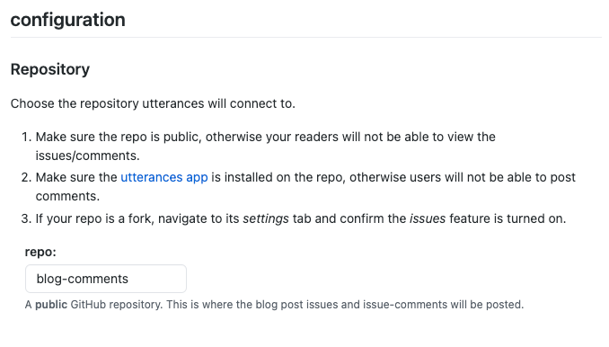

깃허브 블로그에서는 백엔드 서버가 따로 없어 댓글을 관리하려면 다른 대안이 필요합니다. 댓글 기능을 제공하는 여러 솔루션이 있지만, 각자 장단이 있습니다.
이 글에서는 Utterances라는 GitHub Issues를 사용하여 댓글을 관리할 수 있는 우아한 솔루션을 제공합니다. 이 튜토리얼에서는 Jekyll을 이용한 깃허브 블로그에 Utterances를 추가하는 방법을 설명합니다.

### Utterances란 무엇인가요?

Utterances는 GitHub Issues를 기반으로 한 가벼운 댓글 위젯입니다. 깃허브의 이슈를 이용해 댓글을 작성할 수 있도록 합니다.

### Utterances의 장점

1. **간단한 설정**: 어떤 정적 사이트 생성기와도 쉽게 통합됩니다.
2. **GitHub 통합**: GitHub의 기존 이슈 추적 및 알림 시스템을 활용합니다.
3. **무료 및 오픈 소스**: 비용이 들지 않으며 필요에 따라 커스터마이징이 가능합니다.
4. **마크다운 지원**: 댓글이 GitHub-flavored Markdown을 지원합니다.
5. **스팸 방지**: 사용자가 GitHub에 로그인해야 하므로 스팸이 줄어듭니다.

### Utterances의 단점

1. **GitHub 계정 필요**: 댓글 작성자는 GitHub 계정이 있어야 합니다.
2. **공개 리포지토리**: Utterances는 공개 리포지토리에서만 작동합니다.
3. **혼합된 이슈**: 댓글과 프로젝트 이슈가 제대로 관리되지 않으면 혼합될 수 있습니다.

### Utterances 추가하는 단계별 가이드

#### 1단계: GitHub 리포지토리 생성

먼저 댓글을 저장할 GitHub 리포지토리가 필요합니다. 기존 리포지토리를 사용할 수도 있고, 댓글 전용 새 리포지토리를 만들 수도 있습니다.

1. [GitHub](https://github.com){:target="_blank"}에 접속하여 로그인합니다.
2. "New" 버튼을 클릭하여 새 리포지토리를 만듭니다.
3. 리포지토리 이름을 예를 들어 `blog-comments`로 설정합니다.
4. 리포지토리를 공개로 설정합니다.
5. "Create repository"를 클릭합니다.

#### 2단계: Utterances 설정

1. [Utterances 웹사이트](https://utteranc.es/)를 방문합니다.
2. 아래로 스크롤하여 설정 섹션으로 이동합니다.
3. 댓글용으로 생성한 리포지토리를 선택합니다.

4. 사용할 이슈 항목(term)을 선택합니다 (예: 경로명, URL, 제목).
5. 제공된 스크립트를 복사합니다.

#### 3단계: Jekyll 블로그에 Utterances 추가

1. Jekyll 블로그 프로젝트를 엽니다.
2. `_layouts` 디렉토리로 이동하여 `post.html` (또는 게시물 레이아웃 파일)을 엽니다.
3. 댓글이 나타나길 원하는 위치에 Utterances 스크립트를 붙여넣습니다. 예를 들어: